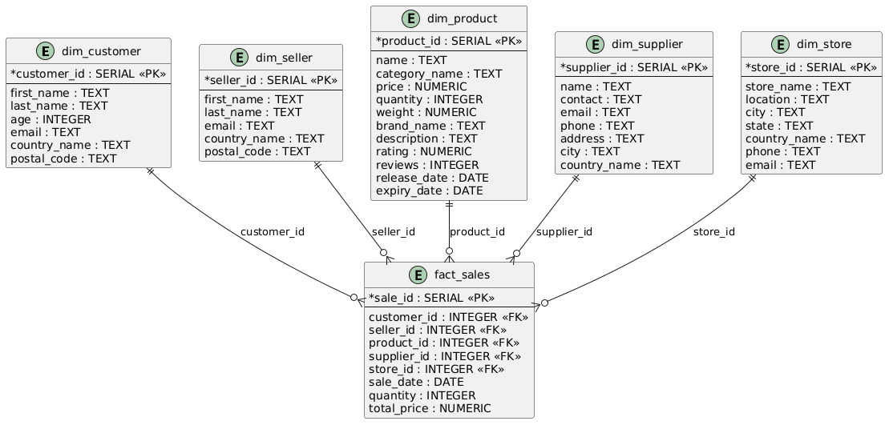

# BigDataSpark

Анализ больших данных - лабораторная работа №2 - ETL реализованный с помощью Spark

Одним из самых популярных фреймворков для работы с Big Data является Apache Spark. Apache Spark - мощный фреймворк, который предлагает широкий набор функциональности для простого написания ETL-пайплайнов.

Был реализован ETL-пайплайн с помощью Spark, который трансформирует данные из источника (файлы mock_data.csv с номерами) в модель данных звезда в PostgreSQL, а затем на основе модели данных звезда создается ряд отчетов по данным в ClickHouse. Каждый отчет представляет собой отдельную таблицу в NoSQL БД.

В данной ЛР вся работа с БД происходила через Apache Spark, что позволяет легко масштабировать ETL-процесс.

Были созданы 5 файлов:

- 001-init_db.sql загружает сырые данные в таблицу mock_data
- 002-ddl.sql создает таблицы по схеме "звезда"
- star.ipynb - преобразует сырые данные из mock_data в схему "звезда"
- clickhouse.ipynb - создает аналитические витрины в ClickHouse
- docker-compose.yml - для запуска приложения в контейнере

Были созданы 6 отчетов:
1. Витрина продаж по продуктам
Цель: Анализ выручки, количества продаж и популярности продуктов.
 - Топ-10 самых продаваемых продуктов.
 - Общая выручка по категориям продуктов.
 - Средний рейтинг и количество отзывов для каждого продукта.
2. Витрина продаж по клиентам
Цель: Анализ покупательского поведения и сегментация клиентов.
 - Топ-10 клиентов с наибольшей общей суммой покупок.
 - Распределение клиентов по странам.
 - Средний чек для каждого клиента.
3. Витрина продаж по времени
Цель: Анализ сезонности и трендов продаж.
 - Месячные и годовые тренды продаж.
 - Сравнение выручки за разные периоды.
 - Средний размер заказа по месяцам.
4. Витрина продаж по магазинам
Цель: Анализ эффективности магазинов.
 - Топ-5 магазинов с наибольшей выручкой.
 - Распределение продаж по городам и странам.
 - Средний чек для каждого магазина.
5. Витрина продаж по поставщикам
Цель: Анализ эффективности поставщиков.
 - Топ-5 поставщиков с наибольшей выручкой.
 - Средняя цена товаров от каждого поставщика.
 - Распределение продаж по странам поставщиков.
6. Витрина качества продукции
Цель: Анализ отзывов и рейтингов товаров.
 - Продукты с наивысшим и наименьшим рейтингом.
 - Корреляция между рейтингом и объемом продаж.
 - Продукты с наибольшим количеством отзывов.

#### Вывод

В процессе выполнения лабораторной работы я познакомился с Apache Spark, позволяющий эффективно работать с большим количеством данных. А так же поработал с ClickHouse, куда записывались итоговые отчеты. Результатом работы стала программа, позволяющая быстро преобразовывать "сырые данные" в готовые отчеты, которые уже намного информативнее исходных данных.

#### Приложения

Запуск проекта: [docs.md](docs.md)

Схема базы данных "звезда"

